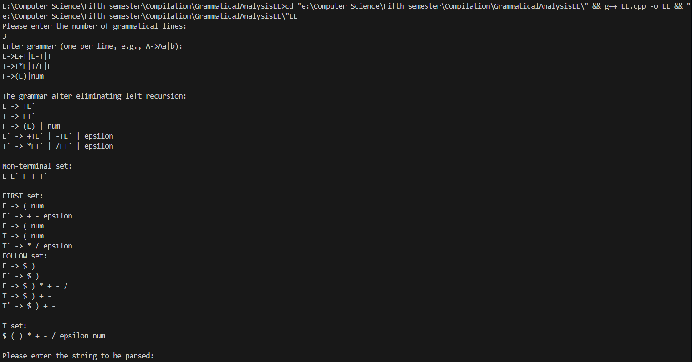
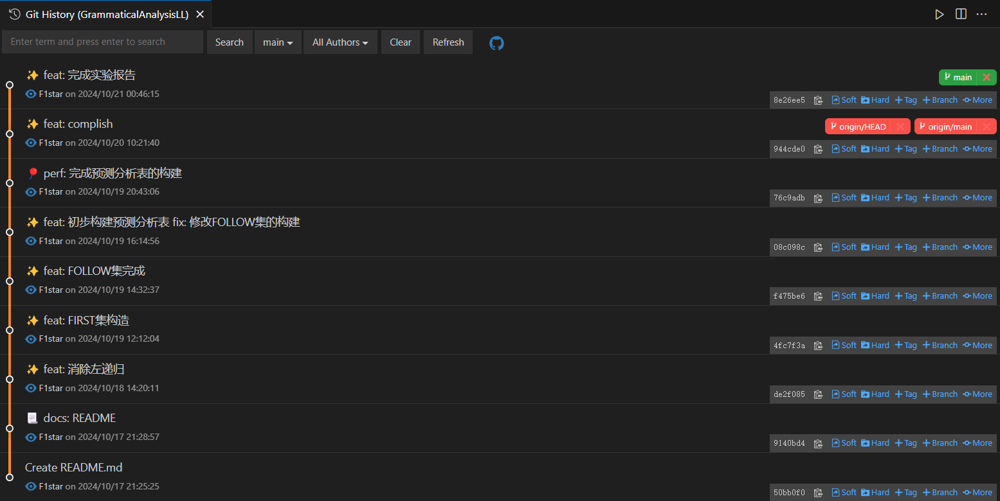

# LL设计实现实验报告

## 实验题目：语法分析程序的设计与实现--LL分析方法

## 实验要求

### 1. 实验内容要求
- 编写LL(1)语法分析程序，实现对算术表达式的语法分析。要求所分析算数表达式由如下的文法产生。 
```
E → E+T | E–T | T 
T → T*F | T/F | F 
F → (E) | num 
```
### 2. 实验测试要求
- 在对输入的算术表达式进行分析的过程中，依次输出所采用的产生式。 
### 3. 实现方法要求
- (1) 编程实现算法4.2，为给定文法自动构造预测分析表。 
- (2) 编程实现算法4.1，构造LL(1)预测分析程序。 

## 程序设计说明

### **1. 程序功能概述**

该程序旨在实现一个基于LL(1)文法的语法分析器。主要功能包括：
- 文法的输入与解析。
- 消除左递归，确保文法符合LL(1)分析表构造的要求。
- 计算每个非终结符的FIRST集和FOLLOW集。
- 构造LL(1)预测分析表（Parse Table）。
- 对输入字符串进行分析，基于预测分析表生成分析过程。

### **2. 程序的主要模块及功能**

1. **主函数 `main()`：**
```cpp
int main() {
    int n;
    std::cout << "Please enter the number of grammatical lines: " << std::endl;
    cin >> n;
    cin.ignore();  // 忽略缓冲区中的换行符
    std::vector<string> s(n);
    
    std::cout << "Enter grammar (one per line, e.g., A->Aa|b): " << std::endl;
    for (int i = 0; i < n; ++i) {
        getline(cin, s[i]);
    }
    
    std::vector<vector<string>> initG;
    for (const auto& str : s) {
        std::vector<string> words = split(str);
        initG.push_back(words);
    }

    // Eliminate left recursion
    eliminateLeftRecursion(initG);

    // Print the resulting grammar
    std::cout << "\nThe grammar after eliminating left recursion:" << std::endl;
    for (const auto& words : initG) {
        std::cout << words[0] << " -> ";
        for (int i = 1; i < words.size(); ++i) {
            std::cout << words[i];
            if (i < words.size() - 1) {
                std::cout << " | ";
            }
        }
        std::cout << std::endl;
    }

    for (const auto& words : initG) {
        nonTset.insert(words[0]);
    }
```
```cpp
    cout << endl;
    cout << "Non-terminal set: " << endl;
    for (auto word : nonTset) {
        cout << word << " ";
    }
    cout << endl;

    cout << endl;

    findFIRST(initG);
    findFOLLOW(initG);

    createPAtable(initG);

    cout << "\nT set:" << endl;
    for (const auto & i : Tset) {
        cout << i << " ";
    }
    cout << endl;

    cout << "\nPlease enter the string to be parsed: " << endl;
    string str;
    cin >> str;
    if (str[str.length()-1] != '$') {
        str += "$";
    }

    analysisLL(str, initG[0][0]);
}
```
   - 用户输入文法的条数 `n` 和文法规则，每条规则形如 `A->Aa|b`。
   - 调用辅助函数对文法进行预处理（如消除左递归）。
   - 输出消除左递归后的文法。
   - 生成非终结符集合 `nonTset`。
   - 调用 `findFIRST()` 计算FIRST集。
   - 调用 `findFOLLOW()` 计算FOLLOW集。
   - 使用 `createPAtable()` 构造预测分析表 `M`。
   - 接收用户输入的字符串，并调用 `analysisLL()` 对输入字符串进行分析。

2. **函数 `split()`：**
```cpp
std::vector<string> split(const std::string &grammar) {
    std::vector<string> results;
    size_t arrowPos = grammar.find("->");  

    if (arrowPos == std::string::npos) {  
        std::cerr << "Error: No '->' found in the grammar rule." << std::endl;  
        return {};  
    } 

    std::string leftSide = grammar.substr(0, arrowPos);
    results.push_back(leftSide);
    std::string rightSide = grammar.substr(arrowPos + 2);
    size_t barPos = rightSide.find("|");  

    while (barPos != std::string::npos) {  
        results.push_back(rightSide.substr(0, barPos));
        rightSide = rightSide.substr(barPos + 1);
        barPos = rightSide.find("|");  
    }

    results.push_back(rightSide);
    return results;
}
```
   - 将用户输入的文法规则分割为左部和右部，并处理右部的多个产生式（使用 `|` 分隔）。
   - 返回一个字符串向量，包含左部非终结符和所有产生式。

3. **函数 `eliminateLeftRecursion()`：**
```cpp
void eliminateLeftRecursion(std::vector<std::vector<string>> &grammar) {
    for (int i = 0; i < grammar.size(); ++i) {
        std::vector<string> alpha; // 左递归部分
        std::vector<string> beta;  // 非左递归部分
        std::string nonTerminal = grammar[i][0]; // 当前非终结符
        bool hasLeftRecursion = false;

        for (int j = 1; j < grammar[i].size(); ++j) {
            if (grammar[i][j].find(nonTerminal) == 0) {
                hasLeftRecursion = true;
                alpha.push_back(grammar[i][j].substr(nonTerminal.length())); // 提取左递归部分
            } else {
                beta.push_back(grammar[i][j]); // 非左递归部分
            }
        }

        if (hasLeftRecursion) {
            // 新的非终结符名称
            std::string newNonTerminal = nonTerminal + "'";

            // 生成非左递归规则：A -> B A'
            grammar[i].clear();
            grammar[i].push_back(nonTerminal);
            for (const auto& b : beta) {
                grammar[i].push_back(b + newNonTerminal);
            }

            // 生成左递归规则：A' -> A' alpha | epsilon
            std::vector<string> newRule;
            newRule.push_back(newNonTerminal);
            for (const auto& a : alpha) {
                newRule.push_back(a + newNonTerminal);
            }
            newRule.push_back(EPSILON);

            // 添加新规则
            grammar.push_back(newRule);
        }
    }
}
```
   - 消除文法中的直接左递归，确保文法符合LL(1)分析的要求。
   - 对于每个非终结符，分离其左递归和非左递归部分，生成新的非终结符。
   - 修改后的规则满足LL(1)文法的要求。

4. **辅助函数 `containsAnySubstring()` 、 `containNonT()` 、 `containsSubFollow()` 和 `findFirstString()`：**
```cpp
size_t containsAnySubstring(const std::string& target, const std::set<std::string>& substrings) {
    // 遍历set中的每个字符串
    size_t minPosition = target.length() + 1; 
    for (const auto& sub : substrings) {
        // 使用 find 函数查找子串
        size_t temp = target.find(sub);
        if(temp != string::npos && temp < minPosition) {
            minPosition = temp; // 更新最小位置
        }
    }
    if (minPosition == target.length() + 1) {
        return string::npos;  // 没有找到，返回空
    }
    return minPosition;
}
```
```cpp
string containNonT(const std::string& target, const std::set<std::string>& substrings) {
    // 遍历set中的每个字符串 
    string result = "";
    for (const auto& sub : substrings) {
        // 使用 find 函数查找子串
        size_t temp = target.find(sub);
        if(temp != string::npos && temp == 0) {
            if(result.length() < sub.length()) {
                result = sub;
            }
        }
    }
    return result;
}
```
```cpp
string containsSubFollow(const std::string& target, const std::set<std::string>& substrings) {
    // 遍历set中的每个字符串
    size_t minPosition = target.length() + 1; 
    string result = "";
    for (const auto& sub : substrings) {
        // 使用 find 函数查找子串
        size_t temp = target.find(sub);
        if(temp != string::npos && temp < minPosition) {
            minPosition = temp; // 更新最小位置
            result = sub;
        }
    }
    if (target.length() > minPosition + result.length()) {
        if (target[minPosition + result.length()] == '\''){
            result = result + "'";
        }
    }
    
    return result;
}
```
```cpp
string findFirstString(const std::string& target) {
    for (const auto& it : Tset) {
        if(target.find(it) == 0) {
            return it;
        }
    }
    return containsSubFollow(target, nonTset);
}
```
   - 用于检查字符串中是否包含集合中的任意子串，帮助在FIRST集、FOLLOW集和终结符集的构造过程中定位非终结符和终结符。
   - 帮助解析字符串中的开头是否包含非终结符和终结符。

5. **函数 `findKey()` 和 `findSet()`：**
```cpp
std::string findKey(const std::map<std::string, std::string> &mymap, const std::string &key) {
    for (auto it = mymap.begin(); it != mymap.end(); ++it) {
        if (it->first == key) {
            return it->first;
        }
    }
    return "";
} 
```
```cpp
void findSet(const std::set<std::array<string, 2>> &myset, const std::string & key){
    for (auto it : myset) {
        if(it[0] == key) {
            for (const auto& str : follow[it[0]]) {
                follow[it[1]].insert(str);
                Tset.insert(str);
            }
            findSet(myset, it[1]);
        }
    }
}
``` 
   - 在构造FIRST集和FOLLOW集时，用于实现集合之间的关联关系，达到不断更新集合的效果。


6. **函数 `findFIRST()`：**
```cpp
void findFIRST(const std::vector<std::vector<string>> &grammar) {
    // 第一遍找 FIRST
    for (const auto& words : grammar) {
        for (int i = 1; i < words.size(); ++i) {
            size_t temp = containsAnySubstring(words[i], nonTset);
            if (temp == string::npos) {
                first[words[0]].insert(words[i]);
                Tset.insert(words[i]);
            } else if (temp != 0 && words[i].find(words[0] + "'") == string::npos) {
                first[words[0]].insert(words[i].substr(0, temp));
                Tset.insert(words[i].substr(0, temp));
            }
        }  
    }
```
```cpp
    std::map<string, string> equalNonT; 

    // 第二遍找 FIRST
    for (const auto& words : grammar) {
        for (int i = 1; i < words.size(); ++i) {
            string temp = containNonT(words[i], nonTset);
            if (temp != "") {
                equalNonT[temp] = words[0];
            }
        }  
    }

    for (auto it = equalNonT.begin(); it != equalNonT.end(); ++it) {
        for (const auto& str : first[it->first]) {
            if (str != EPSILON) {
                first[it->second].insert(str);
                Tset.insert(str);
            }
        }
        string temp = it->second;
        while (findKey(equalNonT, temp) != "") {
            for (const auto& str : first[temp]) {
                if (str != EPSILON) {
                    first[it->second].insert(str);
                    Tset.insert(str);
                }
            }
            temp = equalNonT[temp];
        }
    }

    // TODO: 完成第三遍找 FIRST （本题用不到，暂时搁置）

    std::cout << "FIRST set:" << endl;
    for (auto it = first.begin(); it != first.end(); ++it) {
        std::cout << it->first << " -> ";
        for(auto str : it->second) {
            std::cout << str << " ";
        }
        std::cout << endl;
    }
}
```
   - 计算所有非终结符的FIRST集。
   - 分多遍处理：第一遍直接找到终结符；第二遍递归处理非终结符之间的关系。
   - 输出结果，便于检查和调试。

7. **函数 `findFOLLOW()`：**
```cpp
void findFOLLOW(const std::vector<std::vector<string>> &grammar) {
    // 文法开始符号，置 $ 于 FOLLOW(S) 中
    follow[grammar[0][0]].insert("$");

    // 若有产生式 A -> alphaBbeta, 则把 FIRST(beta) 中的所有非 epsilon 加入 FOLLOW(B)中
    for (const auto& words : grammar) {
        for (int i = 1; i < words.size(); ++i) {
            string temp = containsSubFollow(words[i], nonTset);
            while (temp != "") {
                string subString = words[i].substr(words[i].find(temp) + temp.length());
                string temp2 = containsSubFollow(subString, nonTset);
                if(temp2 == "" && subString != ""){
                    follow[temp].insert(subString);
                    Tset.insert(subString);
                } else {
                    size_t pos = subString.find(temp2);
                    if (pos == 0) {
                        for(const auto& str : first[temp2]) {
                            if (str != EPSILON){
                                follow[temp].insert(str);
                                Tset.insert(str);

                            }
                        }
                    } else {
                        follow[temp].insert(subString.substr(0, pos));
                        Tset.insert(subString.substr(0, pos));
                    }
                }  
                temp = temp2;
            }
        }
    }
```
```cpp
    std::set<std::array<string, 2>> equalNonT; 

    // // 若有产生式 A -> alphaB, 或有产生式 A -> alphaBbeta, 但是 epsilon \in FIRST(beta), 则把 FOLLOW(A) 中所有元素加入 FOLLOW(B) 中
    for (const auto& words : grammar) {
        for (int i = 1; i < words.size(); ++i) {
            string temp = containsSubFollow(words[i], nonTset);
            while (temp != "") {
                string subString = words[i].substr(words[i].find(temp) + temp.length());
                if (subString == "" && words[0] != temp){
                    equalNonT.insert({words[0], temp});
                    break;
                }
                string temp2 = containsSubFollow(subString, nonTset);
                if(temp2 != "") {
                    size_t pos = subString.find(temp2);
                    if (pos == 0) {
                        for(const auto& str : first[temp2]) {
                            if (str == EPSILON){
                                equalNonT.insert({words[0], temp});
                            }
                        }
                    }
                }  
                temp = temp2;
            }
        }
    }

    for (auto it : equalNonT) {
        for (const auto& str : follow[it[0]]) {
            follow[it[1]].insert(str);
            Tset.insert(str);
        }
        string temp = it[1];
        findSet(equalNonT, temp);
    }

    // print follow set
    std::cout << "FOLLOW set:" << endl;
    for (auto it = follow.begin(); it != follow.end(); ++it) {
        std::cout << it->first << " -> ";
        for(auto str : it->second) {
            std::cout << str << " ";
        }
        std::cout << endl;
    }
}
```
   - 计算所有非终结符的FOLLOW集。
   - 根据规则：文法的开始符号的FOLLOW集包含`$`。
   - 若有产生式 `A -> alphaBbeta`，则把 `FIRST(beta)` 的非`epsilon`元素加入 `FOLLOW(B)`。
   - 若 `A -> alphaB` 或 `A -> alphaBbeta` 且 `epsilon` 在 `FIRST(beta)` 中，则将 `FOLLOW(A)` 中的元素加入 `FOLLOW(B)`。

8. **函数 `createPAtable()`：**
```cpp
void createPAtable(const std::vector<std::vector<string>> &grammar) {
    for (const auto& words : grammar) {
        for (int i = 1; i < words.size(); ++i) {
            string pos = containsSubFollow(words[i], nonTset);
            if (pos == "") {
                if (words[i] != EPSILON) {
                    M[words[0]][words[i]] = {words[0],words[i]};
                } else {
                    for (const auto& str : follow[words[0]]) {
                        M[words[0]][str] = {words[0], words[i]};
                    }
                }
            } else if (words[i].find(pos) == 0) {
                for (const auto& str : first[pos]) {
                    if (str != EPSILON) {
                        M[words[0]][str] = {words[0], words[i]};
                    } else {
                        for (const auto& str2 : follow[words[0]]) {
                            M[words[0]][str2] = {words[0], words[i]};
                        }
                    }
                }
            } else {
                M[words[0]][words[i].substr(0, words[i].find(pos))] = {words[0], words[i]};
            }
        }
    }
```
```cpp
    // 错误处理
    for (const auto& it : nonTset){
        for (const auto& str : follow[it]) {
            if (M[it][str][0] == "") {
                M[it][str] = {"synch", ""};
            }
        }
    }
}
```
   - 构造LL(1)预测分析表 `M`。
   - 根据每个产生式的右部决定向分析表中插入的内容。
   - 对于 `epsilon` 产生式，使用 `FOLLOW` 集补充分析表中的对应项。
   - 为缺失的分析表项加入同步动作 `synch`，用于错误处理。

9. **函数 `analysisLL()`：**
```cpp
void analysisLL(const std::string &str, const std::string &S) {
    string input = str;
    std::regex pattern(R"([0-9]*\.?[0-9]+([eE][-+]?[0-9]+)?)");
    std::smatch matches;
    std::string replacement = "num";
    std::string text = input;
    while (std::regex_search(text, matches, pattern)) {
        numSet.push(matches[0]);
        text = matches.suffix().str();
    }
    text = std::regex_replace(input, pattern, replacement);

    std::stack<string> run;
    std::stack<string> tran;
    run.push("$");
    run.push(S);
    string temp1;
    string temp2;

    while (!run.empty()) {
        temp1 = run.top();
        temp2 = findFirstString(text);
```
```cpp        
    if (temp1 == temp2) {
            run.pop();
            text = text.substr(temp2.length());
            cout << endl;
        } else {
            if (M[temp1][temp2][0] == "synch") {
                cout << "Error" << endl;
                run.pop();
            } else if (M[temp1][temp2][0] == "") {
                cout << "Error" << endl;
                text = text.substr(temp2.length());
            } else {
                cout << M[temp1][temp2][0] << " -> " << M[temp1][temp2][1] << endl;
                run.pop();
                if (M[temp1][temp2][1] != EPSILON) {
                    string tempString = M[temp1][temp2][1];
                    string temp3 = findFirstString(tempString);
                    while (temp3 != ""){
                        tran.push(temp3);
                        tempString = tempString.substr(temp3.length());
                        temp3 = findFirstString(tempString);
                    } 
                    while (!tran.empty()) {
                        run.push(tran.top());
                        tran.pop();
                    }
                }
            }
        }
    }
}
```
   - 对输入字符串进行分析。
   - 使用栈模拟语法分析过程，匹配输入符号与分析表中对应的产生式。
   - 处理输入字符串中的数字，将其统一转换为 `num` 标记。
   - 若匹配成功，输出产生式规则；若出现错误，输出错误信息并根据分析表中的`synch`进行同步。

### **3. 数据结构**

- **非终结符与终结符集合：**
  - `nonTset`：非终结符集合，存储文法中的所有非终结符。
  - `Tset`：终结符集合，存储文法中的所有终结符。

- **FIRST集与FOLLOW集：**
  - `first`：`std::map<std::string, std::set<std::string>>`，每个非终结符映射到其FIRST集。
  - `follow`：`std::map<std::string, std::set<std::string>>`，每个非终结符映射到其FOLLOW集。

- **预测分析表 `M`：**
  - `M`：`std::map<std::string, std::map<std::string, std::array<std::string, 2>>>`，用于存储LL(1)预测分析表，其中`std::array`保存产生式的左部和右部。

- **辅助队列与栈：**
  - `numSet`：`std::queue<std::string>`，用于存储输入字符串中的数字。
  - `run` 和 `tran`：`std::stack<std::string>`，用于在分析过程中记录栈中的符号和待处理的产生式。

### **4. 主要算法**

1. **消除左递归**：
   - 将左递归的产生式拆分成非递归部分和递归部分，生成新规则，消除直接左递归。

2. **FIRST集与FOLLOW集的计算**：
   - 使用多遍扫描法构建FIRST集和FOLLOW集。
   - 递归处理非终结符之间的依赖关系，确保FIRST集和FOLLOW集的正确性。
   - FIRST集算法描述
        - 若 $X\in V_T$，则 $FIRST(X)={X}$;
        - 若 $X\in V_N$，且有产生式 $X\to a\cdots$，其中 $a\in V_T$,则把 $a$ 加入到 $FIRST(X)$ 中;
        - 若 $X\in\epsilon$ 也是产生式，则 $\epsilon$ 也加入到 $FIRST(X)$ 中。若 $X\to Y\cdots$ 是产生式，且 $Y\in V_N$，则把 $FIRST(Y)$ 中的所有非 $\epsilon$ 元素加入到 $FIRST(X)$ 中;
        - 若 $X\to Y_1Y_2\cdots Y_k$ 是产生式，如果对某个 $i$, $FIRST(Y_1)、FIRST(Y_2)、…、FIRST(Y_{i-1})$ 都含有 $\epsilon$ 即 $Y_1Y_2\cdots Y_{i-1}\Rightarrow^* \epsilon$,则把 $FIRST(Y_i)$ 中的所有非 $\epsilon$ 元素加入到 $FIRST(X)$ 中； 若所有 $FIRST(Y_i)$ 均含有 $\epsilon$，其中 $i=-1、2、…、k$，则把 $\epsilon$ 加入到 $FIRST(X)$ 中。
    - FOLLOW集算法描述
        - 对文法开始符号 $S$ ，置 \$ 于 $FOLLOW(S)$ 中 \$ 为输入符号串的右尾标志。
        - 若 $A\to\alpha B\beta$ 是产生式，则把 $FIRST(B)$ 中的所有非 $\epsilon$ 元素加入到 $FOLLOW(B)$ 中。
        - 若 $A\to\alpha B$ 是产生式，或 $A\to\alpha B\beta$ 是产生式并且 $\beta\Rightarrow^*\epsilon$ 则把 $FOLLOW(A)$ 中的所有元素加入到 $FOLLOW(B)$ 中
        - 重复此过程，直到所有集合不再变化为止。

3. **预测分析表构造**：
   - 根据文法规则和FIRST集填充分析表的条目。
   - 对于`epsilon`产生式，使用FOLLOW集进行补充。
   - 算法描述
    ```tex
       for(文法 $G$ 的每个产生式 $A\to\alpha$) {
            for(每个终结符号 $\alpha\in FIRST(\alpha)$)
                把 $A->\alpha$ 加入到 $M[A][\alpha]$ 中;
            if($\epsilon\in FIRST(\alpha)$)
                for(任何 $b\in FOLLOW(A)$)
                    把 $A\to\alpha$放入 $M[A,b]$ 中;
       };
       for(所有无定义的 $M[A,a]$)
            标上错误标志;
    ```
       

4. **LL(1)分析过程**：
   - 使用栈模拟文法的分析过程，根据预测分析表选择对应的产生式。
   - 对输入字符串逐字符处理，输出分析步骤或错误信息。


### **5. 结论**

该程序实现了一个完整的LL(1)文法分析器，从文法的输入与解析到生成分析表并进行语法分析。通过消除左递归、计算FIRST和FOLLOW集、构造预测分析表，确保LL(1)分析的正确性，并能够对输入的字符串进行逐步分析。

## 测试报告

### 1. **输入**

- 输入题目所要求的文法，第一行为文法的行数 `n`，接下来 `n` 行分别表示文法的产生式。
```
3
E->E+T|E-T|T
T->T*F|T/F|F
F->(E)|num
```
- 输入待分析的字符串 `str`，以 `$` 结束。
```
123+4.56-78.9e+4*(234+56)/23$
```

### 2. **运行结果**

- 如图所示，对文法的分析运行结果

```
Please enter the number of grammatical lines:
3
Enter grammar (one per line, e.g., A->Aa|b): 
E->E+T|E-T|T
T->T*F|T/F|F
F->(E)|num

The grammar after eliminating left recursion:
E -> TE'
T -> FT'
F -> (E) | num
E' -> +TE' | -TE' | epsilon
T' -> *FT' | /FT' | epsilon

Non-terminal set: 
E E' F T T' 

FIRST set:
E -> ( num 
E' -> + - epsilon 
F -> ( num
T -> ( num
```
```
T' -> * / epsilon
FOLLOW set:
E -> $ )
E' -> $ )
F -> $ ) * + - /
T -> $ ) + -
T' -> $ ) + -

T set:
$ ( ) * + - / epsilon num
```

- 如图所示，对字符串的分析运行结果

```
Please enter the string to be parsed:
123+4.56-78.9e+4*(234+56)/23$
E -> TE'
T -> FT'
F -> num
```
```

T' -> epsilon
E' -> +TE'

T -> FT'
F -> num

T' -> epsilon
E' -> -TE'

T -> FT'
F -> num

T' -> *FT'

F -> (E)

E -> TE'
T -> FT'
F -> num

T' -> epsilon
E' -> +TE'

T -> FT'
F -> num

T' -> epsilon
E' -> epsilon

T' -> /FT'

F -> num

T' -> epsilon
E' -> epsilon


```

### 3. **分析说明**
- 本测试用例手工分析如图所示


- 可以见得，程序运行结果与手工分析的结果一致。

### 4. **结论**

通过测试，该程序能够正确地处理所给的文法，并能够对输入的字符串进行语法分析。程序运行结果与手工分析的结果一致，说明程序能够正确实现LL(1)文法分析器的功能。

- 附：代码提交图
